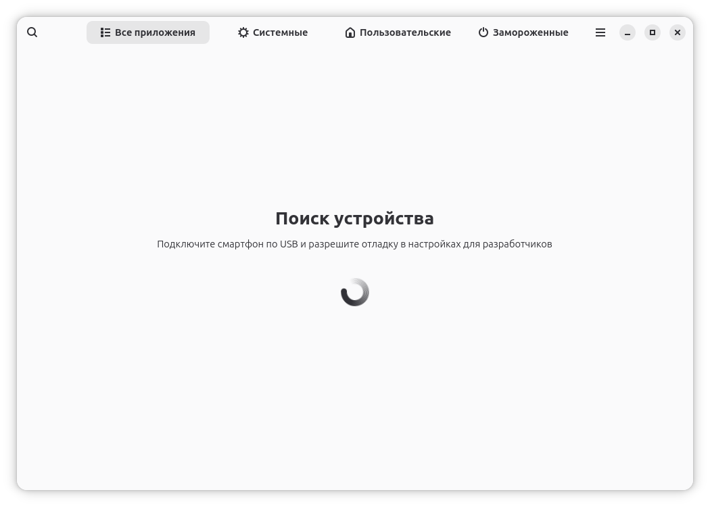
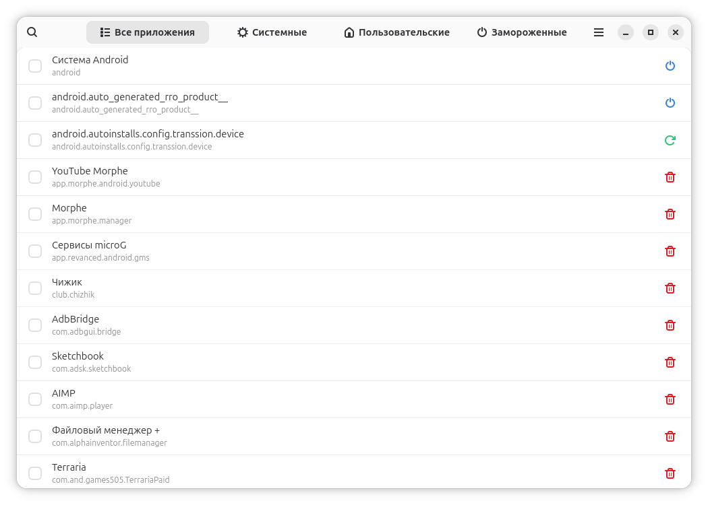
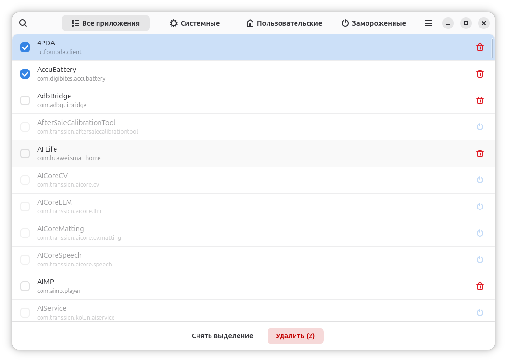
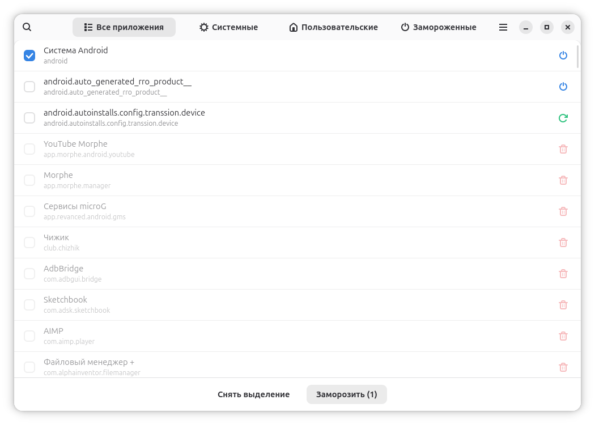

# AdbGUI 

Графический интерфейс для управления приложениями на Android-устройствах через ADB. Построен на базе **Python 3.13**, **GTK4** и **Libadwaita**.

## Скриншоты
<table>
  <tr>
    <td></td>
    <td></td>
  </tr>
  <tr>
    <td></td>
    <td></td>
  </tr>
</table>

## Основные возможности
- **Сортировка приложений:** Автоматическое разделение на системные, пользовательские и замороженные приложения.
- **Массовые операции**: Замораживайте, размораживайте или удаляйте несколько приложений одновременно.
- **Интеграция моста**: Автоматическая установка `bridge.apk` для получения локализованных названий приложений.

## Технические особенности
- **Автономность**: Все необходимые компоненты (ADB и apk-мост) включены в состав Flatpak-пакета.

## Установка
Программа поставляется в виде готового `.flatpak` файла в разделе [Releases](https://github.com/ВАШ_НИК/adbgui/releases).

**Для ручной сборки:**
```bash
git clone https://github.com/Alastt28/AdbGUI.git
cd AdbGUI
meson setup build
meson compile -C build
meson install -C build
