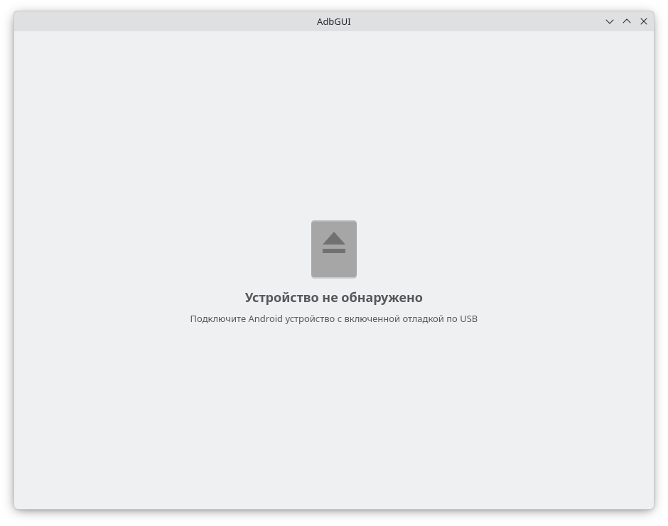
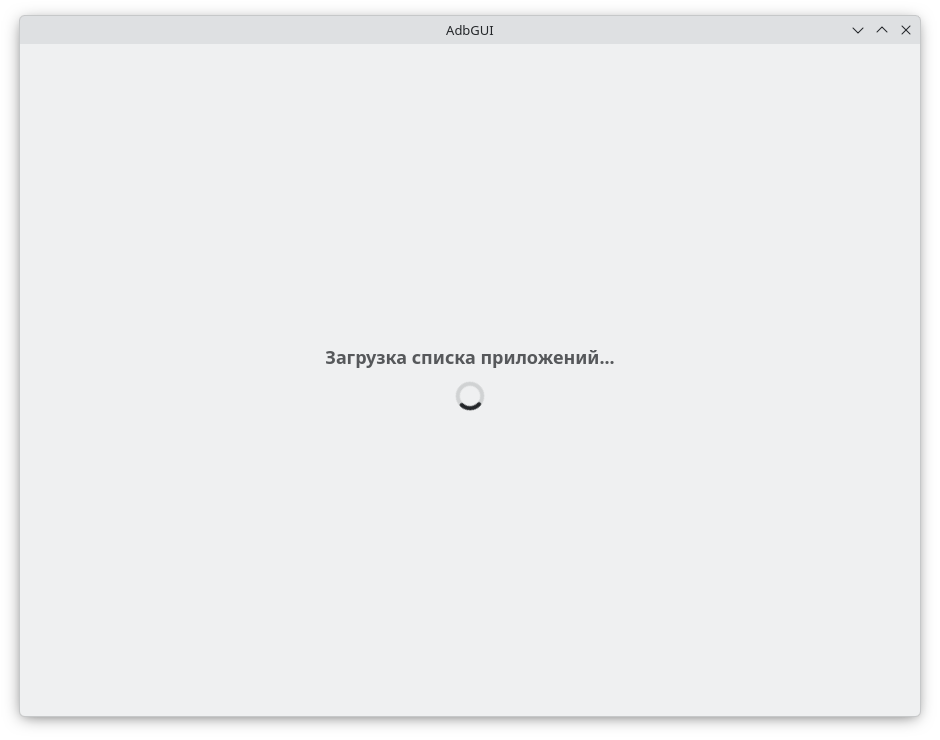
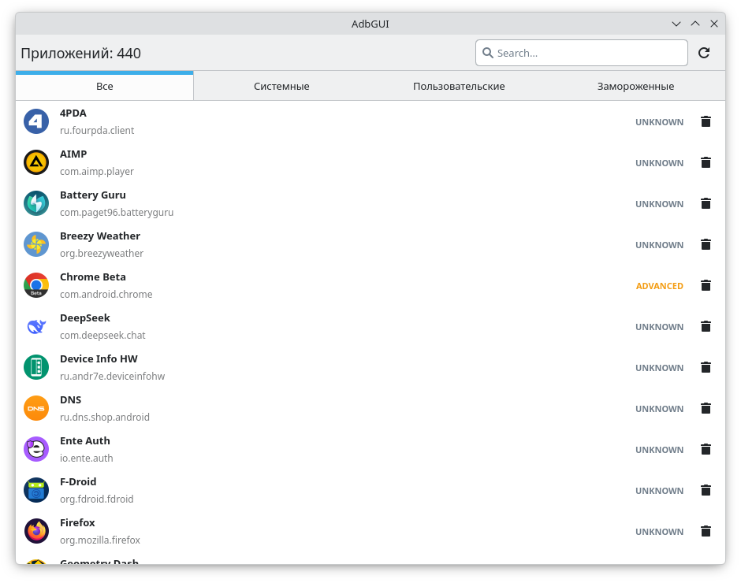
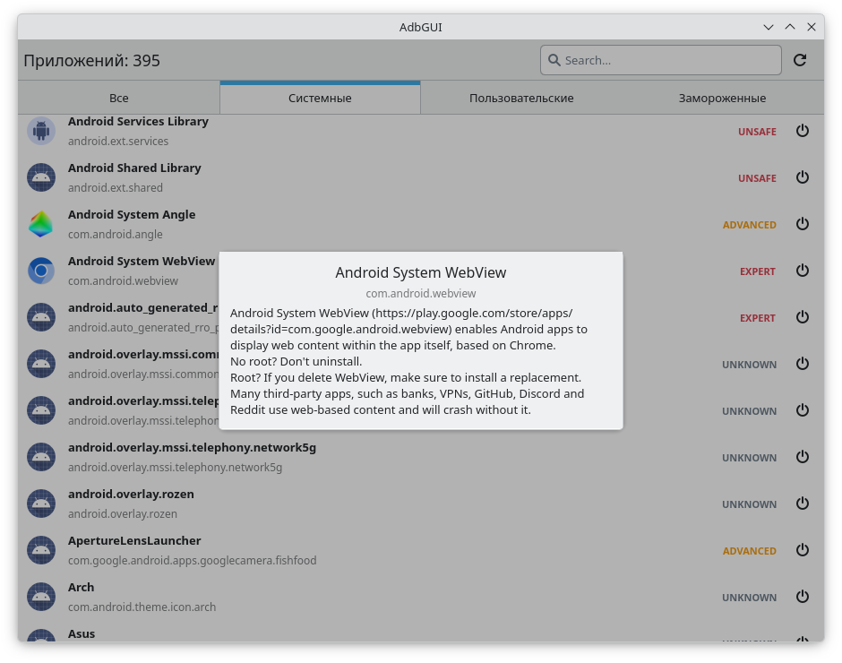

# AdbGUI 

Графический интерфейс для управления приложениями на Android-устройствах через ADB. Построен на базе **Python**, **QT 6** и **Kirigami**. 
Для описания приложений используется **UAD** https://github.com/Universal-Debloater-Alliance/universal-android-debloater-next-generation.

## Скриншоты
<table>
  <tr>
    <td></td>
    <td></td>
  </tr>
  <tr>
    <td></td>
    <td></td>
  </tr>
</table>

## Установка
Программа поставляется в виде готового `.flatpak` файла в разделе [Releases](https://github.com/Alastt28/AdbGUI/releases).

